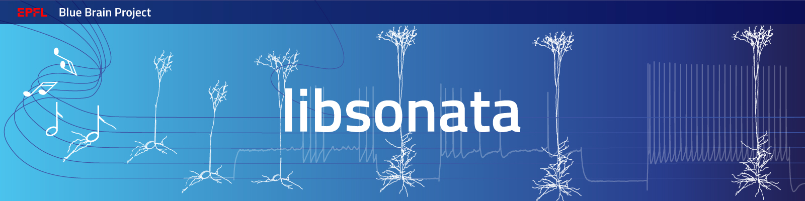

C++ / Python reader for SONATA circuit files:
https://github.com/AllenInstitute/sonata/blob/master/docs/SONATA_DEVELOPER_GUIDE.md

[](https://coveralls.io/github/BlueBrain/libsonata)

# Installation

## Building the C++ library

```shell
git clone git@github.com:BlueBrain/libsonata.git --recursive
cd libsonata
mkdir build && cd build
cmake  -DCMAKE_BUILD_TYPE=Release  -DEXTLIB_FROM_SUBMODULES=ON ..
make -j
```
