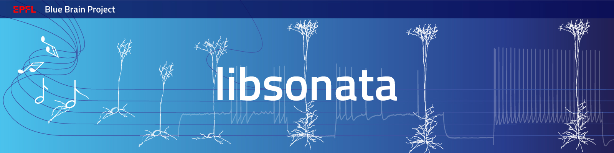

|banner|

|license| |coverage| |docs|

libsonata
=========

C++ / Python reader for SONATA circuit files:
`SONATA guide <https://github.com/AllenInstitute/sonata/blob/master/docs/SONATA_DEVELOPER_GUIDE.md>`__

Installation
------------

Installing from PyPI
~~~~~~~~~~~~~~~~~~~~

.. code-block:: shell

   pip install libsonata

Installing as a Python package, directly from GitHub
~~~~~~~~~~~~~~~~~~~~~~~~~~~~~~~~~~~~~~~~~~~~~~~~~~~~

.. code-block:: shell

   pip install git+https://github.com/BlueBrain/libsonata

Building the C++ library
~~~~~~~~~~~~~~~~~~~~~~~~

.. code-block:: shell

   git clone git@github.com:BlueBrain/libsonata.git --recursive
   cd libsonata
   mkdir build && cd build
   cmake  -DCMAKE_BUILD_TYPE=Release  -DEXTLIB_FROM_SUBMODULES=ON ..
   make -j

Usage (Python)
--------------

Nodes
~~~~~

NodeStorage
+++++++++++

.. code-block:: pycon

   >>> import libsonata

   >>> nodes = libsonata.NodeStorage('path/to/H5/file')

   # list populations
   >>> nodes.population_names

   # open population
   >>> population = nodes.open_population(<name>)

NodePopulation
++++++++++++++

.. code-block:: pycon

   # total number of nodes in the population
   >>> population.size

   # attribute names
   >>> population.attribute_names

   # get attribute value for single node, say 42
   >>> population.get_attribute('mtype', 42)

   # ...or Selection of nodes (see below) => returns NumPy array with corresponding values
   >>> selection = libsonata.Selection(values=[1, 5, 9, 42])  # nodes 1, 5, 9, 42
   >>> mtypes = population.get_attribute('mtype', selection)
   >>> list(zip(selection.flatten(), mtypes))
   [(1, u'mtype_of_1'), (5, u'mtype_of_5'), (9, u'mtype_of_9'), (42, u'mtype_of_42')]

Selection
+++++++++

List of element IDs (either `node_id`, or `edge_id`) where adjacent IDs are grouped for the sake of efficient HDF5 file access.
For instance, `{1, 2, 3, 5}` sequence becomes `{[1, 4), [5, 6)}`.

`Selection` can be instantiated from:
 - a sequence of scalar values (works for NumPy arrays as well)
 - a sequence of pairs (interpreted as ranges above, works for N x 2 NumPy arrays as well)

`EdgePopulation` connectivity queries (see below) return ``Selection``\ s as well.

.. code-block:: pycon

   >>> selection = libsonata.Selection([1, 2, 3, 5])
   >>> selection.ranges
   [(1, 4), (5, 6)]

.. code-block:: pycon

   >>> selection = libsonata.Selection([(1, 4), (5, 6)])
   >>> selection.flatten()
   [1, 2, 3, 5]
   >>> selection.flat_size
   4
   >>> bool(selection)
   True

Edges
~~~~~

EdgeStorage
+++++++++++

Population handling for `EdgeStorage` is analogous to `NodeStorage`:

.. code-block:: pycon

   >>> edges = libsonata.EdgeStorage('path/to/H5/file')

   # list populations
   >>> edges.population_names

   # open population
   >>> population = edges.open_population(<name>)

EdgePopulation
++++++++++++++

.. code-block:: pycon

   # total number of edges in the population
   >>> population.size

   # attribute names
   >>> population.attribute_names

   # get attribute value for single edge, say 123
   >>> population.get_attribute('delay', 123)

   # ...or Selection of edges => returns NumPy array with corresponding values
   >>> selection = libsonata.Selection([1, 5, 9])
   >>> population.get_attribute('delay', selection) # returns delays for edges 1, 5, 9

...with additional methods for querying connectivity, where the results are selections that can be applied like above

.. code-block:: pycon

   # get source / target node ID for the 42nd edge:
   >>> population.source_node(42)
   >>> population.target_node(42)

   # query connectivity (result is Selection object)
   >>> selection_to_1 = population.afferent_edges(1)  # all edges with target node_id 1
   >>> population.target_nodes(selection_to_1)  # since selection only contains edges
                                                # targeting node_id 1 the result will be a
                                                # numpy array of all 1's
   >>> selection_from_2 = population.efferent_edges(2)  # all edges sourced from node_id 2
   >>> selection = population.connecting_edges(2, 1)  # this selection is all edges from
                                                      # node_id 2 to node_id 1

   # ...or their vectorized analogues
   >>> selection = population.afferent_edges([1, 2, 3])
   >>> selection = population.efferent_edges([1, 2, 3])
   >>> selection = population.connecting_edges([1, 2, 3], [4, 5, 6])

Reports
~~~~~~~

SpikeReader
+++++++++++

.. code-block:: pycon

   >>> import libsonata

   >>> spikes = libsonata.SpikeReader('path/to/H5/file')

   # list populations
   >>> spikes.get_populations_names()

   # open population
   >>> population = spikes['<name>']

SpikePopulation
+++++++++++++++

.. code-block:: pycon

   # get all spikes [(node_id, timestep)]
   >>> population.get()
   [(5, 0.1), (2, 0.2), (3, 0.3), (2, 0.7), (3, 1.3)]

   # get all spikes betwen tstart and tstop
   >>> population.get(tstart=0.2, tstop=1.0)
   [(2, 0.2), (3, 0.3), (2, 0.7)]

   # get spikes attribute sorting (by_time, by_id, none)
   >>> population.sorting
   'by_time'

   Pandas can be used to create a dataframe and get a better representation of the data

.. code-block:: pycon

   >>> import pandas

   data = population.get()
   df = pandas.DataFrame(data=data, columns=['ids', 'times']).set_index('times')
   print(df)
          ids
   times
   0.1      5
   0.2      2
   0.3      3
   0.7      2
   1.3      3

SomaReportReader
++++++++++++++++

.. code-block:: pycon

   >>> somas = libsonata.SomaReportReader('path/to/H5/file')

   # list populations
   >>> somas.get_populations_names()

   # open population
   >>> population_somas = somas['<name>']

SomaReportPopulation
++++++++++++++++++++

.. code-block:: pycon

   # get times (tstart, tstop, dt)
   >>> population_somas.times
   (0.0, 1.0, 0.1)

   # get unit attributes
   >>> population_somas.time_units
   'ms'
   >>> population_somas.data_units
   'mV'

   # node_ids sorted?
   >>> population_somas.sorted
   True

   # get a list of all node ids in the selected population
   >>> population_somas.get_node_ids()
   [1, 2, 3, 4, 5, 6, 7, 8, 9, 10, 11, 12, 13, 14, 15, 16, 17, 18, 19, 20]

   # get the DataFrame of the node_id values for the timesteps between tstart and tstop
   >>> data_frame = population_somas.get(node_ids=[13, 14], tstart=0.8, tstop=1.0)

   # get the data values
   >>> data_frame.data
   [[13.8, 14.8], [13.9, 14.9]]

   # get the list of timesteps
   >>> data_frame.times
   [0.8, 0.9]

   # get the list of node ids
   >>> data_frame.ids
   [13, 14]

Once again, pandas can be used to create a dataframe using the data, ids and times lists

.. code-block:: pycon

   >>> import pandas

   df = pandas.DataFrame(data_frame.data, columns=data_frame.ids, index=data_frame.times)
   print(df)
          13    14
   0.8  13.8  14.8
   0.9  13.9  14.9

ElementReportReader
+++++++++++++++++++

.. code-block:: pycon

   >>> elements = libsonata.ElementReportReader('path/to/H5/file')

   # list populations
   >>> elements.get_populations_names()

   # open population
   >>> population_elements = elements['<name>']

ElementReportPopulation
+++++++++++++++++++++++

.. code-block:: pycon

   # get times (tstart, tstop, dt)
   >>> population_elements.times
   (0.0, 4.0, 0.2)

   >>> population_elements.get_node_ids()
   [1, 2, 3, 4, 5, 6, 7, 8, 9, 10, 11, 12, 13, 14, 15, 16, 17, 18, 19, 20]

   # get the DataFrame of the node_id values for the timesteps between tstart and tstop
   >>> data_frame = population_elements.get(node_ids=[13, 14], tstart=0.8, tstop=1.0)

   # get the data values (list of list of floats with data[time_index][element_index])
   >>> data_frame.data
   [[46.0, 46.1, 46.2, 46.3, 46.4, 46.5, 46.6, 46.7, 46.8, 46.9], [56.0, 56.1, 56.2, 56.3, 56.4, 56.5, 56.6, 56.7, 56.8, 56.9]]

   # get the list of timesteps
   >>> data_frame.times
   [0.8, 1.0]

   # get the list of (node id, element_id)
   >>> data_frame.ids
   [(13, 30), (13, 30), (13, 31), (13, 31), (13, 32), (14, 32), (14, 33), (14, 33), (14, 34), (14, 34)]

The same way than with spikes and soma reports, pandas can be used to get a better representation of the data

.. code-block:: pycon

   >>> import pandas

   df = pandas.DataFrame(data_frame.data, columns=pandas.MultiIndex.from_tuples(data_frame.ids), index=data_frame.times)
   print(df)
          13                            14
          30    30    31    31    32    32    33    33    34    34
   0.8  46.0  46.1  46.2  46.3  46.4  46.5  46.6  46.7  46.8  46.9
   1.0  56.0  56.1  56.2  56.3  56.4  56.5  56.6  56.7  56.8  56.9

For big datasets, using numpy arrays could greatly improve the performance

.. code-block:: pycon

   >>> import numpy

   np_data = numpy.asarray(data_frame.data)
   np_ids = numpy.asarray(data_frame.ids).T
   np_times = numpy.asarray(data_frame.times)

   df = pandas.DataFrame(np_data, columns=pandas.MultiIndex.from_arrays(np_ids), index=np_times)

Acknowledgements
----------------

This project/research has received funding from the European Union’s Horizon 2020 Framework Programme for Research and Innovation under the Specific Grant Agreement No. 785907 (Human Brain Project SGA2).

License
-------

libsonata is distributed under the terms of the GNU Lesser General Public License version 3,
unless noted otherwise, for example, for external dependencies.
Refer to `COPYING.LESSER` and `COPYING` files for details.

Copyright (C) 2018-2020, Blue Brain Project/EPFL and contributors.

libsonata is free software: you can redistribute it and/or modify
it under the terms of the GNU Lesser General Public License version 3
as published by the Free Software Foundation.

libsonata is distributed in the hope that it will be useful,
but WITHOUT ANY WARRANTY; without even the implied warranty of
MERCHANTABILITY or FITNESS FOR A PARTICULAR PURPOSE.  See the
GNU Lesser General Public License for more details.

You should have received a copy of the GNU Lesser General Public License
along with libsonata.  If not, see <https://www.gnu.org/licenses/>.

.. |license| image:: https://img.shields.io/pypi/l/libsonata
                :target: https://github.com/BlueBrain/libsonata/blob/master/COPYING.LESSER

.. |coverage| image:: https://coveralls.io/repos/github/BlueBrain/libsonata/badge.svg
                 :target: https://coveralls.io/github/BlueBrain/libsonata

.. |docs| image:: https://readthedocs.org/projects/libsonata/badge/?version=latest
             :target: https://libsonata.readthedocs.io/
             :alt: documentation status

.. substitutions

